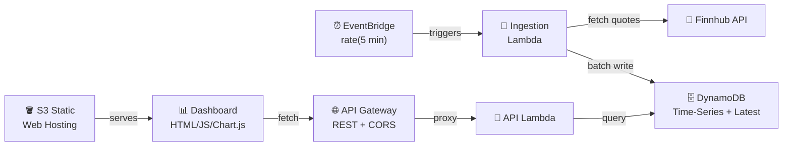
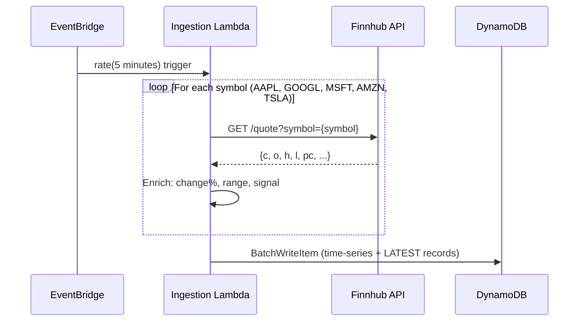

# ⚡ Stock Pulse

> **Real-time stock data pipeline & dashboard** built entirely on AWS serverless architecture.

A production-grade data engineering project that ingests live stock quotes every 5 minutes, processes them into enriched metrics, and serves them through a sleek real-time dashboard — all deployed with a single command.

---

## 📐 Architecture

```
EventBridge (5 min) → Ingestion Lambda (Docker) → DynamoDB → API Lambda → API Gateway → S3 Dashboard
```



### How It Works

1. **Scheduled Ingestion** — An EventBridge rule fires every 5 minutes, invoking the Ingestion Lambda
2. **Data Enrichment** — The Lambda fetches real-time quotes from [Finnhub API](https://finnhub.io), calculates derived metrics (price change, intraday range, market signals), and batch-writes to DynamoDB
3. **Dual-Write Pattern** — Each ingestion writes both a **time-series record** (`STOCK#SYMBOL + timestamp`) and a **latest snapshot** (`LATEST#SYMBOL`) for O(1) dashboard queries
4. **TTL-Based Cleanup** — Records auto-expire after 7 days via DynamoDB TTL, keeping storage lean
5. **REST API** — API Gateway + Lambda serves three endpoints with full CORS support
6. **Live Dashboard** — A static HTML/JS app on S3 auto-refreshes every 60s, showing cards with sparklines and drill-down charts

---

## 🛠️ Tech Stack

| Layer | Technology | Why |
|-------|-----------|-----|
| **Scheduler** | EventBridge | Serverless cron, zero infrastructure, native Lambda integration |
| **Compute** | Lambda (Docker) | Demonstrates containerized serverless; Python 3.12 runtime |
| **Storage** | DynamoDB | On-demand billing, built-in TTL, ideal for key-value + time-series pattern |
| **API** | API Gateway (REST) | Managed API with CORS, throttling, and Lambda proxy integration |
| **Frontend** | S3 + Chart.js | Zero build step, instant deploy, CDN-ready |
| **Containers** | ECR | Private Docker registry for Lambda images |
| **IaC** | CloudFormation | Native AWS, single-template deployment, no extra tooling |

---

## 📁 Project Structure

```
stock-pulse/
├── infrastructure/
│   └── template.yaml              # CloudFormation — all AWS resources
├── lambdas/
│   ├── ingestion/
│   │   ├── Dockerfile             # Python 3.12 Lambda base image
│   │   ├── requirements.txt       # requests
│   │   └── handler.py             # Fetch → Enrich → Store pipeline
│   └── api/
│       ├── Dockerfile
│       ├── requirements.txt       # boto3 (pre-installed)
│       └── handler.py             # Query → Serve JSON with CORS
├── frontend/
│   ├── index.html                 # Dashboard SPA
│   ├── style.css                  # Dark-mode glassmorphism design
│   └── app.js                     # Chart.js charts, auto-refresh, routing
├── scripts/
│   ├── deploy.sh                  # One-command full deployment
│   └── build-and-push.sh          # Docker build → ECR push
├── .env.example                   # Environment template (no secrets)
├── .gitignore
└── README.md
```

---

## 🔄 Data Pipeline Deep Dive

### Ingestion Lambda (`lambdas/ingestion/handler.py`)



**Enrichment logic per quote:**
- **Price Change** — `current - previous_close` (absolute + percentage)
- **Intraday Range** — `high - low`
- **Market Signal** — `bullish` if both open% and close% > 0.5%, `bearish` if both < -0.5%, else `neutral`
- **Volume Classification** — `low` / `normal` / `high` based on thresholds
- **Market Hours** — Boolean flag based on US ET weekday hours

### DynamoDB Data Model

```json
{
  "pk": "STOCK#AAPL",           // Partition key: symbol-scoped
  "sk": 1708732800,             // Sort key: epoch timestamp
  "symbol": "AAPL",
  "current_price": 189.84,
  "open": 188.50,
  "high": 190.20,
  "low": 187.90,
  "previous_close": 188.00,
  "change": 1.84,
  "change_percent": 0.98,
  "intraday_range": 2.30,
  "signal": "bullish",
  "market_open": true,
  "day_of_week": "Monday",
  "ingestion_time": "2024-02-24T01:30:00Z",
  "ttl": 1709337600              // Auto-expire after 7 days
}
```

**Access patterns:**
| Pattern | Key Condition | Use Case |
|---------|--------------|----------|
| Get latest for all stocks | `pk = LATEST#{symbol}`, `sk = 0` | Dashboard home (5 queries) |
| Get 24h history | `pk = STOCK#{symbol}`, `sk >= now-86400` | Sparkline charts |
| Get 7-day history | `pk = STOCK#{symbol}`, `sk >= now-604800` | Detail view charts |

---

## 🔌 API Reference

Base URL: `https://{api-id}.execute-api.{region}.amazonaws.com/prod`

| Method | Endpoint | Description | Response |
|--------|----------|-------------|----------|
| `GET` | `/stocks` | Latest data for all tracked symbols | `{ stocks: [...], count, timestamp }` |
| `GET` | `/stocks/{symbol}` | Last 24h of data points | `{ symbol, data: [...], period: "24h" }` |
| `GET` | `/stocks/{symbol}/history` | Last 7 days of data | `{ symbol, data: [...], period: "7d" }` |

<details>
<summary><b>Example: GET /stocks</b></summary>

```json
{
  "stocks": [
    {
      "symbol": "AAPL",
      "current_price": 189.84,
      "change": 1.84,
      "change_percent": 0.98,
      "open": 188.50,
      "high": 190.20,
      "low": 187.90,
      "previous_close": 188.00,
      "intraday_range": 2.30,
      "signal": "bullish",
      "market_open": true,
      "ingestion_time": "2024-02-24T01:30:00Z"
    }
  ],
  "count": 5,
  "timestamp": "2024-02-24T01:30:05Z"
}
```
</details>

---

## 🚀 Deployment

### Prerequisites

- **AWS CLI** configured with IAM user (needs Lambda, DynamoDB, S3, ECR, API Gateway, EventBridge, CloudFormation, IAM permissions)
- **Docker** installed and running
- **Finnhub API key** — free at [finnhub.io/register](https://finnhub.io/register) (60 calls/min)

### Deploy (3 commands)

```bash
# 1. Configure your environment
cp .env.example .env
# Edit .env → add your FINNHUB_API_KEY

# 2. Make scripts executable
chmod +x scripts/*.sh

# 3. Deploy everything
./scripts/deploy.sh
```

### What `deploy.sh` Does

```
Step 1/6 → Creates ECR repositories (if they don't exist)
Step 2/6 → Builds Docker images (linux/amd64) → pushes to ECR
Step 3/6 → Deploys CloudFormation stack (DynamoDB, Lambda, API GW, S3, EventBridge)
Step 4/6 → Retrieves stack outputs (API URL, Dashboard URL)
Step 5/6 → Injects API URL into frontend config
Step 6/6 → Syncs frontend files to S3
```

After deployment, the dashboard URL and API URL are printed. Data starts flowing within 5 minutes.

---

## 🏗️ CloudFormation Resources

The single `template.yaml` creates:

| Resource | Type | Purpose |
|----------|------|---------|
| `StockDataTable` | DynamoDB Table | On-demand, pk/sk schema, TTL enabled |
| `IngestionLambda` | Lambda (Docker) | 512MB, 60s timeout, EventBridge triggered |
| `ApiLambda` | Lambda (Docker) | 256MB, 10s timeout, API Gateway integrated |
| `IngestionScheduleRule` | EventBridge Rule | `rate(5 minutes)` schedule |
| `StockPulseApi` | API Gateway REST | 3 GET endpoints + CORS OPTIONS |
| `FrontendBucket` | S3 Bucket | Static website hosting |
| `IngestionLambdaRole` | IAM Role | DynamoDB write-only access |
| `ApiLambdaRole` | IAM Role | DynamoDB read-only access |

---

## 💰 Cost Estimation (Free Tier)

| Service | Monthly Usage | Cost |
|---------|--------------|------|
| Lambda | ~8,640 invocations, 256-512MB | **$0.00** |
| DynamoDB | ~500K reads/writes, on-demand | **$0.00** |
| API Gateway | ~50K requests | **$0.00** |
| EventBridge | 8,640 rule invocations | **$0.00** |
| S3 | <1MB static files | **~$0.01** |
| ECR | ~500MB images | **~$0.05** |
| **Total** | | **~$0.06/month** |

---

## 🔮 Future Enhancements

- [ ] Technical indicators (RSI, MACD, Bollinger Bands) via a processing Lambda
- [ ] SNS/email alerts for significant price movements (>3% change)
- [ ] Historical data backfill using Step Functions
- [ ] CloudFront CDN for dashboard with custom domain
- [ ] CI/CD pipeline with GitHub Actions (lint → build → deploy)
- [ ] WebSocket API via API Gateway v2 for real-time push updates
- [ ] Grafana/QuickSight integration for advanced analytics

---

## 📜 License

MIT — feel free to fork, extend, and use as a portfolio piece.
